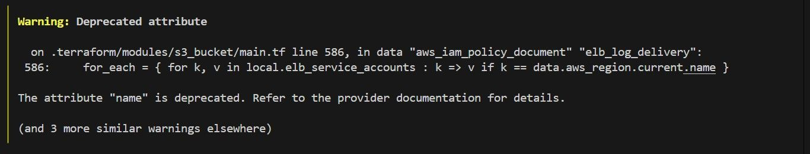

# AWS Bedrock Knowledge Base with Aurora Serverless

This project sets up an AWS Bedrock Knowledge Base integrated with an Aurora Serverless PostgreSQL database. It also includes scripts for database setup and file upload to S3.

## Table of Contents

1. [Project Overview](#project-overview)
2. [Prerequisites](#prerequisites)
3. [Project Structure](#project-structure)
4. [Deployment Steps](#deployment-steps)
5. [Using the Scripts](#using-the-scripts)
6. [Customization](#customization)
7. [Troubleshooting](#troubleshooting)

## Project Overview

This project consists of several components:

1. Stack 1 - Terraform configuration for creating:
   - A VPC
   - An Aurora Serverless PostgreSQL cluster
   - s3 Bucket to hold documents
   - Necessary IAM roles and policies

2. Stack 2 - Terraform configuration for creating:
   - A Bedrock Knowledge Base
   - Necessary IAM roles and policies

3. A set of SQL queries to prepare the Postgres database for vector storage

4. A Python script for uploading files to an s3 bucket

The goal is to create a Bedrock Knowledge Base that can leverage data stored in an Aurora Serverless database, with the ability to easily upload supporting documents to S3. This will allow us to ask the LLM for information from the documentation.


## Prerequisites

Before you begin, ensure you have the following:

- AWS CLI installed and configured with appropriate credentials
- Terraform installed (version 0.12 or later)
- Python 3.10 or later
- pip (Python package manager)


## Project Structure

```
project-root/
│
├── stack1
|   ├── main.tf
|   ├── outputs.tf
|   └── variables.tf
|
├── stack2
|   ├── main.tf
|   ├── outputs.tf
|   └── variables.tf
|
├── modules/
│   ├── aurora_serverless/
│   │   ├── main.tf
│   │   ├── variables.tf
│   │   └── outputs.tf
|   |
│   └── bedrock_kb/
│       ├── main.tf
│       ├── variables.tf
│       └── outputs.tf
│
├── scripts/
│   ├── aurora_sql.sql
│   └── upload_to_s3.py
│
├── spec-sheets/
│   └── machine_files.pdf
│
├── __init__.py
│
├── .gitignore
│
├── app.py
│
├── bedrock_utils.py
│
├── README.md
│
└── requirements.txt
```


## Deployment Steps

For several weeks I was unable to recreate this project until I realised that the AWS platform has upgraded most of its services leading to several errors during building. These are the steps I took to ensure the project was completed using the original codes provided.

1. Create a Github repository udacity_aws_project, only add the .gitignore and LICENCE, then create codespaces
<br>

2. Install the AWS CLI v2
   ```
   curl "https://awscli.amazonaws.com/awscli-exe-linux-x86_64.zip" -o "awscliv2.zip"
   unzip awscliv2.zip
   sudo ./aws/install
   ```
  <br>

3. To check the version run
   ```
   aws --version
   ```
<br>

4. Remove the awscliv2.zip download
   ```
   rm awscliv2.zip
   ```
<br>

5. Install Teraform
   ```
   wget -O - https://apt.releases.hashicorp.com/gpg | sudo gpg --dearmor -o /usr/share/keyrings/hashicorp-archive-keyring.gpg
   echo "deb [arch=$(dpkg --print-architecture) signed-by=/usr/share/keyrings/hashicorp-archive-keyring.gpg] https://apt.releases.hashicorp.com $(grep -oP '(?<=UBUNTU_CODENAME=).*' /etc/os-release || lsb_release -cs) main" | sudo tee /etc/apt/sources.list.d/hashicorp.list
   sudo apt update && sudo apt install terraform
   ```
<br>

6. Install venv if it's not already installed, on Ubuntu/Debian
   ```
   sudo apt-get install python3-venv
   ```
<br>

7. Create a new directory for the project and navigate to it
   ```
   mkdir bedrock-rag-project
   cd bedrock-rag-project
   ```
<br>

8. Create and activate a virtual environment
   ```
   python -m venv venv
   source venv/bin/activate
   ```
<br>

9. Clone this repository to the local machine
   ```
   git clone https://github.com/udacity/cd13926-Building-Generative-AI-Applications-with-Amazon-Bedrock-and-Python-project-solution.git
   ```
<br>

10. Move all the files to bedrock-rag-project using the move_files.py file and delete the cd13926... folder
   ```
   python move_files.py
   ```
<br>

11. Configure AWS CLI with your credentials, last two stay the same
   ```
   aws configure
   ```
<br>

12. The required input are shown below
   ```
   AWS Access Key ID: xxxxxxxxxxxxxxxxxxxxxxxxxxxxxx  # UPDATE
   AWS Secret Access Key: xxxxxxxxxxxxxxxxxxxxxxxxxxxxxx  # UPDATE
   Default Region Name: us-west-2
   Default Output Format: json
   ```
<br>

13. Get the session token
   ```
   eval $(aws sts get-session-token \
      --serial-number arn:aws:iam::xxxxxxxxxxxx:mfa/virtual-token \  # UPDATE
      --token-code xxxxxx \  # UPDATE
      --duration-seconds 28800 \
      --region us-west-2 \
      --output json | jq -r '.Credentials | "export AWS_ACCESS_KEY_ID=\(.AccessKeyId)\nexport AWS_SECRET_ACCESS_KEY=\(.SecretAccessKey)\nexport AWS_SESSION_TOKEN=\(.SessionToken)"')
   ```
<br>

14. Check Authentication
   ```
   aws sts get-caller-identity
   ```
<br>

15. Navigate to the project Stack 1. This stack includes VPC, Aurora servlerless and S3
   ```
   cd stack1
   ```
<br>

16. Initialize Terraform
   ```
   terraform init
   ```
<br>

17. Deploy Terraform
   ```
   terraform apply -auto-approve 
   ```
* -auto-approve to avaid typing yes all the time
<br>

18. Error1 - Deprecated attribute S3
<p align="center">
  
</p>
* Change version = "~> 3.0" on line 51 of stack1/main.tf to version = "~> 5.0" and save
<br>

19. If error is encountered update and use
   ```
   rm -rf .terraform .terraform.lock.hcl terraform.tfstate terraform.tfstate.backup && terraform init 
   ```
<br>

20. The deploy the infrastructure
   ```
   terraform apply -auto-approve
   ```
<br>

21. Error2 - Deprecated attribute vpc
<p align="center">
  
</p>
* Change version = "~> 5.0" on line 7 of stack1/main.tf to version = "~> 6.0" and save


4. Review and modify the Terraform variables in `main.tf` as needed, particularly:
   - AWS region
   - VPC CIDR block
   - Aurora Serverless configuration
   - s3 bucket

5. Deploy the infrastructure:
   ```
   terraform apply
   ```
   Review the planned changes and type "yes" to confirm.

6. After the Terraform deployment is complete, note the outputs, particularly the Aurora cluster endpoint.

7. Prepare the Aurora Postgres database. This is done by running the sql queries in the script/ folder. This can be done through Amazon RDS console and the Query Editor.

8. Navigate to the project Stack 2. This stack includes Bedrock Knowledgebase

9. Initialize Terraform:
   ```
   terraform init
   ```

10. Use the values outputs of the stack 1 to modify the values in `main.tf` as needed:
     - Bedrock Knowledgebase configuration

11. Deploy the infrastructure:
      ```
      terraform apply
      ```
      - Review the planned changes and type "yes" to confirm.


12. Upload pdf files to S3, place your files in the `spec-sheets` folder and run:
      ```
      python scripts/upload_to_s3.py
      ```
      - Make sure to update the S3 bucket name in the script before running.

13. Sync the data source in the knowledgebase to make it available to the LLM.

## Using the Scripts

### S3 Upload Script

The `upload_to_s3.py` script does the following:
- Uploads all files from the `spec-sheets` folder to a specified S3 bucket
- Maintains the folder structure in S3

To use it:
1. Update the `bucket_name` variable in the script with your S3 bucket name.
2. Optionally, update the `prefix` variable if you want to upload to a specific path in the bucket.
3. Run `python scripts/upload_to_s3.py`.

## Complete chat app

### Complete invoke model and knoweldge base code
- Open the bedrock_utils.py file and the following functions:
  - query_knowledge_base
  - generate_response

### Complete the prompt validation function
- Open the bedrock_utils.py file and the following function:
  - valid_prompt

  Hint: categorize the user prompt

## Troubleshooting

- If you encounter permissions issues, ensure your AWS credentials have the necessary permissions for creating all the resources.
- For database connection issues, check that the security group allows incoming connections on port 5432 from your IP address.
- If S3 uploads fail, verify that your AWS credentials have permission to write to the specified bucket.
- For any Terraform errors, ensure you're using a compatible version and that all module sources are correctly specified.

For more detailed troubleshooting, refer to the error messages and logs provided by Terraform and the Python scripts.